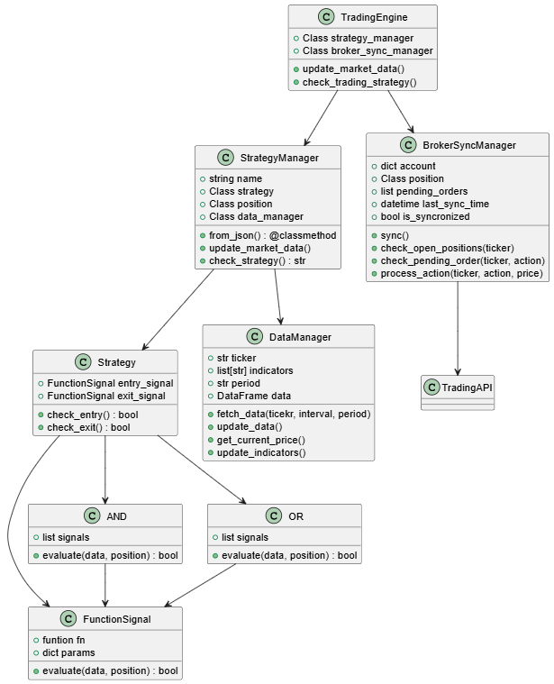

# AlgoTrading V2
Algorithmic Trading using JSON as strategy input, and connecting with Trading212 platform.

## TODO

- TP-SL percentage implemented, Logic for tp-sl adapted for adding more types of tp-sl

- Try to automate the `SIGNAL_REGISTRY` in signals.py

- Add a Backtesting for the strategies using StrategyManager

## Program Architecture

In the image we can see how the architecture of the program was made. The Program has 3 main parts:
* `StrategyManager`:
The purpose of this class is to manage the Strategy  loaded to it. It checks if we need to make a buy or sell.
* `BrokerSyncManager`:
This class recieves the action it needs to perform and connects to the Trading platform and checks if the action can be done.
* `TradingEngine`:
This class is the main brain of the program, it connects the StrategyManager with the BrokerSyncManager and runs the whole program.

## Backtests

For running a backtest on 5 days of historical data and 0.1% commision on strat_2.json run like this

`.venv\Scripts\python main_backtest.py --strategy strategies/strat_2.json --period 5d --commission 0.001 --capital 10000 `

## UI

For running the UI

`.venv\Scripts\uvicorn frontend.main:app --reload`

## Strategies

For creating strategies, we need to create a JSON file in the strategies folder which contains the data for the strategy.
This data is: 
- name
- tickerApi
- tickerData
- indicators
- interval
- period
- action: [t212 only supports "BUY"]
- entry_rule
- exit_rule

There are only some rules and indicators, if you wish to add more which aren't available is done in @classes/data_manager.py `update_indicators()` the indicators, and the rules in @signals/entry_exit_signals.py and a small change in @classes/signals.py on the `SIGNAL_REGISTRY` constant.

IMPORTANT: For seting the indicators and the rules, please check the functions mentioned before for knowing how to do it properly.

